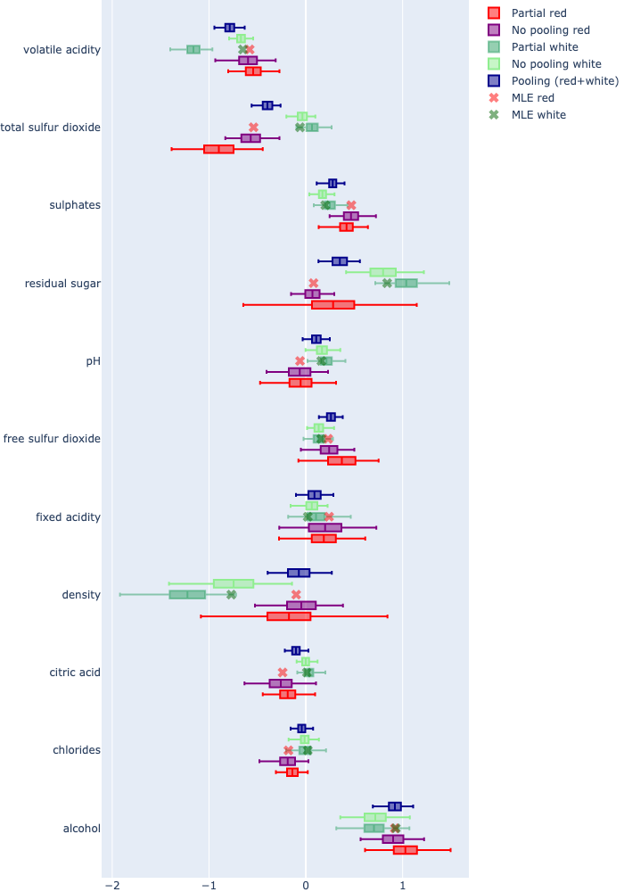

## Background
In data modeling and analysis, small datasets become even more challenging when the data is naturally **partitioned into subgroups**. Whether it’s customer segments, regional variations, or types of wine, these partitions often require separate analysis, further shrinking the data available for each group. Traditional approaches either ignore these partitions, losing critical distinctions, or treat them entirely separately, amplifying the limitations of small sample sizes. This tension—balancing subgroup specificity with the need for robust insights—demands a smarter solution. Enter **Hierarchical Bayesian Inference**, a method that thrives in partitioned datasets by borrowing strength across groups while preserving their unique characteristics. By unlocking the power of shared information, it turns partitioned, small datasets into a fertile ground for meaningful and actionable insights.

## Overview
To unlock the full potential of Hierarchical Bayesian Inference, it helps to start with the basics of Bayesian thinking: a method that updates prior knowledge with new evidence to account for uncertainty. In the following sections, we’ll explore the foundations of Bayesian inference, frame the wine-tasting example to highlight its practical applications, delve into the results and benchmarking of different modeling approaches, and discuss how hierarchical methods compare to traditional alternatives.

At the heart of Bayesian inference lies the **posterior distribution**, which represents updated beliefs about a parameter after incorporating observed data. But how do we work with the posterior to make predictions or extract insights? In practice, we often can’t calculate the posterior analytically, especially in complex models, so we turn to **sampling** methods like **Markov Chain Monte Carlo (MCMC)**. For the sense of brevity we won't expand on MCMC methods and technicalities such as analyzing and validating the sampling process.
## Wine tasting analysis

To see Bayesian sampling in action, let’s revisit the UCI wine quality dataset, with   6,500 wine tasting samples (1,600 red and 4,900 white ) with 11 attributes. Lets assume the goal is to understand how different attributes affect wine quality. Factors such as alcohol content, volatile acidity, and residual sugar are all believed to influence how a wine is perceived. By analyzing these attributes, we can gain insight into which ones play the most significant role in determining whether a wine is considered “good” or “bad.” This approach helps uncover the key characteristics that shape the overall quality of a wine, providing a clearer picture of what contributes to a wine’s appeal and market value. The problem was framed using **logistic regression**, a model that predicts the probability of a binary outcome. In Bayesian terms, the model uses priors for the coefficients to express initial uncertainty about how each attribute (e.g., alcohol level, volatile acidity) affects wine quality.

**Logistic Regression Model**

The model predicts the probability of a wine being “good” (scores greater then 7 in a 1 to 10 score range) as:
$$
P(y = 1 \mid \mathbf{x}, \boldsymbol{\beta}) = \frac{1}{1 + e^{-\boldsymbol{\phi(x)}}}
$$
Here:

• $\mathbf{x}$  is the vector of wine attributes (e.g., alcohol, pH).

• $\boldsymbol{\beta}$  is the vector of coefficients representing the influence of each attribute.

• $\phi(x)=\mathbf{x}^T \boldsymbol{\beta}$ is the linear predictor.

The likelihood of observing the data  $\mathcal{D}$  given the coefficients  $\boldsymbol{\beta}$  is:

$$
P(\mathcal{D} \mid \boldsymbol{\beta}) = \prod_{i=1}^{n} P(y_i \mid \mathbf{x}_i, \boldsymbol{\beta})^{y_i} \big(1 - P(y_i \mid \mathbf{x}_i, \boldsymbol{\beta})\big)^{1 - y_i}
$$
  
### **Hierarchical Bayesian Logistic Regression**

In the wine example, the data is naturally partitioned into red and white wine groups,  
and we can extend the model hierarchically. Instead of estimating separate coefficients  
($\boldsymbol{\beta}_{\text{red}}, \boldsymbol{\beta}_{\text{white}}$) independently, and we assume they are drawn from group-specific distributions whose means ($\boldsymbol{\mu}_{\text{red}}$ and $\boldsymbol{\mu}_{\text{white}}$) are themselves sampled from a higher-level shared prior distribution:
$$  
\boldsymbol{\beta}_{\text{red}} \sim \mathcal{N}(\boldsymbol{\mu}_{\text{red}},  
\boldsymbol{\sigma}_{\text{red}}^2), \quad \boldsymbol{\beta}_{\text{white}} \sim  
\mathcal{N}(\boldsymbol{\mu}_{\text{white}}, \boldsymbol{\sigma}_{\text{white}}^2)  
$$
$$  
\boldsymbol{\mu}_{\text{red}}, \boldsymbol{\mu}_{\text{white}} \sim \mathcal{N}(\boldsymbol{\mu},  
\tau^2)  
$$
Here:  
- $\boldsymbol{\mu}$ is the overall shared mean across groups.  
- $\tau^2$ captures the variability in the group-level means between red and white wines.  
- $\boldsymbol{\sigma}_{\text{red}}^2$ and $\boldsymbol{\sigma}_{\text{white}}^2$ control  
  how much the coefficients can vary within each group.  

This hierarchical structure allows the model to borrow strength across groups, enabling  
more robust estimates even when data is limited for one of the groups. By introducing  
this multi-level uncertainty, the model balances shared trends and group-specific  
differences.

**Sampling the Posterior**
  
To fit this model, we sample from the posterior distribution of $\boldsymbol{\beta}{\text{red}}$, $\boldsymbol{\beta}{\text{white}}$ , and the group-level parameters  $\boldsymbol{\mu}$  and  $\boldsymbol{\sigma}^2$ . Posterior sampling methods generate parameter samples that reflect the joint posterior:
$$
P(\boldsymbol{\beta}{\text{red}}, \boldsymbol{\beta}{\text{white}}, \boldsymbol{\mu}, \boldsymbol{\sigma}^2 \mid \mathcal{D}) \propto P(\mathcal{D} \mid \boldsymbol{\beta}{\text{red}}, \boldsymbol{\beta}{\text{white}}) P(\boldsymbol{\beta}{\text{red}}, \boldsymbol{\beta}{\text{white}} \mid \boldsymbol{\mu}, \boldsymbol{\sigma}^2) P(\boldsymbol{\mu}) P(\boldsymbol{\sigma}^2)
$$
**Why Sampling Matters**

  Sampling allows us to:

1. Estimate credible intervals for coefficients, providing uncertainty quantification (e.g., how strongly alcohol level influences quality for red vs. white wine).

2. Compare posterior distributions between groups, revealing nuanced differences (e.g., volatile acidity may negatively impact white wine more strongly than red wine).

3. Predict wine quality with full uncertainty modeling, improving robustness in decision-making.
  
This approach ensures we extract meaningful insights even with small datasets, as the hierarchical structure borrows strength between red and white wines. The result is a more nuanced and interpretable model that respects the unique and shared qualities of each wine type.

## Results
Before diving into the results, it’s important to understand the different **pooling strategies** used in the analysis, which determine how the data from red and white wines are treated in the model.

1. **No Pooling**: This model fits separate logistic regression models for red and white wines, treating them as entirely distinct groups. It assumes that the effects of attributes are independent between the two types. The equations for red and white wines are:
$$
\phi_{n,j} = \sum_{i=1}^{11} \beta_{i,j} x_{n,j,i}
	$$
	where j represents the wine type (red or white), and $\beta_{i,j}$ are the coefficients specific to each wine type.

2. **Hierarchical Partial Pooling**: the red and white wines are modeled  
	independently, but with shared information through group-level priors, as explained in [**Hierarchical Bayesian Logistic Regression**](#**Hierarchical%20Bayesian%20Logistic%20Regression**) 

3. **Pooling**: The simplest model, where all the data from both red and white wines are combined, treating both types as identical. This model does not allow for any differences between red and white wines and fits a single set of coefficients for both groups. The model is expressed as:
$$
\phi_n = \sum_{i=1}^{11} \beta_i x_{n,i}
$$
	This method is the least flexible, as it doesn’t account for the potential differences between the two wine types.

4. For completeness, we should add a 4th case, **Hierarchical No Pooling**: the red and white wines are modeled independently, and the coefficients for each wine type are estimated separately. The model still imposes a hierarchical structure, but the posteriors for each wine type are sampled independently resulting in independent set of mean ${\mu}_{\text{red}}$, ${\mu}_{\text{white}}$

The first metric we'll use is the **Leave-One-Out Cross-Validation (LOO-CV)** scores, which estimate the model’s out-of-sample predictive accuracy. Lower LOO-CV scores indicate better predictive performance (todo: elaborate on the confidence interval here)

| Model                            | Red Wines     | White Wines    | Both Wines     |
| -------------------------------- | ------------- | -------------- | -------------- |
| **Hierarchical Partial Pooling** | -839.4 ± 20.6 | -2485.9 ± 36.6 | -3325.3 ± 42.0 |
| **No Pooling**                   | -847.2 ± 20.6 | -2824.3 ± 31.9 |                |
| **Hierarchical No Pooling**      | -847.4 ± 20.7 | -2824.2 ± 31.9 |                |
| **Pooling**                      | -947.3 ± 24.2 | -2720.6 ± 28.7 | -3667.9 ± 37.5 |
*Table 1: LOO-CV scores

From the table, we observe that **Hierarchical Partial Pooling** consistently provides the best performance in terms of predictive accuracy, especially when applied to both red and white wines combined. For **red wines**, the difference in LOO-CV scores between the hierarchical partial pooling model and the other methods is marginal, indicating that the smaller red wine sample size does not significantly affect the predictive accuracy. However, for **white wines**, hierarchical partial pooling outperforms all other models, with a significantly lower LOO-CV score, suggesting a much better fit and more reliable predictions.

Additionally, **pooling** (the simplest model) shows the worst performance overall, particularly when considering both red and white wines together, highlighting that treating the two wine types as identical without accounting for their differences leads to poorer predictive accuracy. The **no pooling** models, while more flexible, do not capture the shared trends as effectively as the hierarchical approach, which benefits from the partial pooling of data between the wine types.

The **Hierarchical No Pooling** model performs similarly to **no pooling**, with separate models for red and white wines, but still with a hierarchical structure that imposes some shared uncertainty between the two. This model does not significantly improve upon the **no pooling** approach. From here we can conclude that the additional complexity did not contribute on it's own in the **Hierarchical Partial Pooling** case.

Now, let's see how hierarchical modeling can offer key insight on the attributes effect (linear coefficients values) and effectively handle the data’s structure. 
**Figure 1** visualizes the pairwise relationships and distributions of physicochemical attributes for red and white wines (MLE is the standard maximum likelihood estimator)
*Figure 1: posterior predictive distributions of coefficients

From figure 1, we observe that while the MLE coefficients were mostly consistent with the no pooling results, as they fell within the 95% confidence intervals of the no pooling coefficients, partial pooling leveraged the shared information and allowed for a distinct and more extreme attribute distributions such as for volatile acidity, residual sugar and density of white wines.
